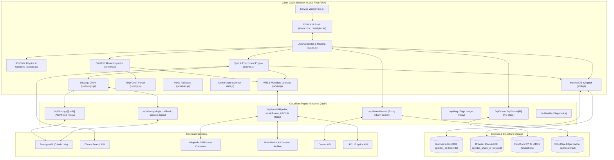

# Spindex Architecture & Technical Reference

This document provides the technical specification and architectural reference for Spindex. It covers the system design, client modules, serverless edge functions, storage schemas, third-party integrations, local development workflow, and deployment instructions.

---

## 1. System Architecture & Tech Stack



### Core Architecture Principles
1. **Vanilla Web Standards**: Built with vanilla HTML5, CSS custom properties, and native ES modules. There is no build step, no framework, and no bundler.
2. **Local-First & Offline Resilience**: Collection records are stored in browser IndexedDB (`spindex_db`). Once loaded, your collection is completely browsable offline through the Service Worker ([sw.js](file:///Users/ryan/Sites/spindex/public/sw.js)).
3. **Zero Secrets in the Client**: Discogs consumer secrets and user access tokens never reach client-side JavaScript. Authentication runs through Cloudflare Pages Functions using encrypted HttpOnly cookie sessions.
4. **On-Demand Synchronization**: No background pollers or battery-draining cron jobs run in the browser. Collection checks are triggered intentionally by the user or when filling an empty crate.
5. **Database Sandbox for Shared Crates**: Viewing a shared collection (`/s/<id>`) opens an isolated IndexedDB instance (`spindex_share_<id>`), ensuring a visitor's own collection is never touched or overwritten.

---

## 2. Directory Structure

```
├── public/                         Static application root (deployed output)
│   ├── index.html                  Primary page shell, crate stage, album view, modals
│   ├── 404.html                    Client-side routing fallback
│   ├── manifest.webmanifest        PWA manifest
│   ├── sw.js                       Service Worker (network-first caching strategy)
│   ├── _redirects                  Cloudflare Pages redirect rules
│   ├── docs/                       Self-contained documentation center (Help Center)
│   │   ├── docs-components.js      Web components (sidebar, header, search, grid, table of contents)
│   │   ├── docs-theme-loader.js    Light/dark mode theme loader
│   │   ├── docs-list.js            Search results and category listing controller
│   │   ├── docs-config.json        Documentation center configuration
│   │   ├── search-index.json       Static search index generated from guide metadata
│   │   ├── style.css               Documentation stylesheet tailored to Spindex theme
│   │   ├── index.html              Generated help center home page
│   │   ├── list.html               Generated category and search results page
│   │   └── <guide-slug>/           Individual user guide directories
│   ├── assets/
│   │   ├── apple-touch-icon.png    iOS icon asset
│   │   └── brand/spindex-mark.svg  Application brand icon
│   ├── css/
│   │   └── style.css               Complete application stylesheet
│   └── js/
│       ├── app.js                  Controller: routing, search, views, settings, scanner
│       ├── crate.js                3D crate physics, CSS transforms, gesture/key handling
│       ├── notes.js                Gatefold album view, tracklist, lyrics, credits, flipper
│       ├── sync.js                 Discogs sync, iTunes enrichment, artist credits parsing
│       ├── discogs.js              Client adapter for Discogs auth and proxy requests
│       ├── wiki.js                 Wikipedia, Wikidata, MusicBrainz, and LRCLIB queries
│       ├── vinyl.js                Pressing format parser for vinyl disc color and finish
│       ├── values.js               Value placeholder helpers
│       ├── db.js                   IndexedDB persistence wrapper
│       └── mock-data.js            12-album demo collection for first-time visits
├── functions/                      Cloudflare Pages Functions (serverless backend)
│   ├── _lib/                       Shared serverless helper modules
│   │   ├── cache.js                Edge caching helper (caches.default)
│   │   ├── deezer.js               Deezer album search and score matching
│   │   ├── http.js                 HTTP header and JSON response utilities
│   │   ├── oauth.js                Discogs OAuth 1.0a signature and request helpers
│   │   ├── proxy.js                Read-only Discogs proxy path allowlist
│   │   ├── session.js              AES-GCM-256 cookie session encryption/decryption
│   │   └── share.js                Collection snapshot serialization and sanitization
│   └── api/                        Serverless HTTP endpoints
│       ├── discogs/                Discogs OAuth and proxy endpoints
│       │   ├── login.js            Initiates OAuth 1.0a flow
│       │   ├── callback.js         Handles OAuth callback and sets session cookie
│       │   ├── session.js          Returns current authentication status
│       │   ├── logout.js           Clears session cookie
│       │   └── [[path]].js         Allowlisted read-only Discogs API proxy
│       ├── ext.js                  CORS proxy for Wikipedia, MusicBrainz, and LRCLIB
│       ├── img.js                  Edge-cached image relay for remote album art
│       ├── health.js               Runtime configuration and binding diagnostics
│       ├── listen/deezer.js        Deezer search proxy with edge caching
│       └── share/                  Collection snapshot sharing
│           ├── index.js            Create or remove shared collection snapshots
│           └── [id].js             Fetch published collection snapshot from KV
├── scripts/                        Documentation generator scripts
│   ├── init-docs.js                Compiles docs/index.html and docs/list.html from templates
│   ├── add-new-doc.js              CLI tool to scaffold new user guide articles
│   ├── generate-docs-index.js      Extracts metadata, syncs OG tags, and outputs search-index.json
│   └── templates/                  HTML shell templates for index.html and list.html
├── tests/                          Automated test suite
│   ├── syntax-test.mjs             Node.js syntax check across all source files
│   ├── basic-test.js               Core integration tests and route verification
│   ├── oauth-test.mjs              Discogs OAuth flow end-to-end against mock server
│   ├── cache-test.mjs              Edge caching and header tests
│   ├── ext-test.mjs                External API proxy and relay tests
│   ├── share-test.mjs              Snapshot generation, KV storage, and sanitization
│   ├── sw-test.mjs                 Service Worker manifest and caching logic
│   ├── vinyl-test.mjs              Vinyl description parsing and styling tests
│   ├── logic-test.mjs              Sync logic, queue management, and deduplication
│   └── barcode-test.mjs            Barcode lookup and parser tests
├── package.json                    Project scripts and development dependencies
├── wrangler.toml                   Cloudflare Pages configuration
└── .dev.vars.example               Template for local environment variables
```

---

## 3. Client Architecture & Modules

The client runs directly in the browser as standard ES modules loaded from [public/index.html](file:///Users/ryan/Sites/spindex/public/index.html).

### [public/js/app.js](file:///Users/ryan/Sites/spindex/public/js/app.js)
The top-level orchestrator. Responsible for:
- Routing: Path parsing for root (`/`), album pages (`/album/<artist>/<title>/`), share routes (`/s/<id>`), and screensaver mode (`/?wall`).
- View switching: Toggling between 3D Stack, Grid, and List views.
- Search and filtering: Debounced search across titles, artists, and songs; genre filtering; decade, format, disc count, and speed filters.
- UI drawers: Settings drawer, statistics drawer ("By the numbers"), barcode scanner drawer, and keyboard shortcuts overlay.
- Barcode scanning: Integrates browser Camera stream via `BarcodeDetector` API, file upload input, and manual barcode entry.
- Screensaver / Wall mode: Canvas-based floating and rotating album cover wall with wake lock integration (`navigator.wakeLock`).

### [public/js/crate.js](file:///Users/ryan/Sites/spindex/public/js/crate.js)
Manages the tactile 3D record stack:
- Computes CSS 3D transforms (`translate3d`, `rotateX`, `rotateY`) for each sleeve in the stack.
- Handles gestures: mouse wheel scrolling, touch drags, swipe physics, velocity momentum, and keyboard navigation (Up, Down, Left, Right, Enter).
- Maintains active sleeve index, flips records as they pass the focal point, and triggers dynamic ambient glow updates.

### [public/js/notes.js](file:///Users/ryan/Sites/spindex/public/js/notes.js)
Powers the Gatefold Album Inspector:
- Renders tracklists with track durations and playback links.
- Fetches and displays lyrics using LRCLIB, providing a slide-over lyric sheet with track navigation and Genius search fallback.
- Sleeve flipper: 3D flip card showing front cover art and reverse cover art (when available from MusicBrainz / Cover Art Archive).
- Vinyl disc preview: Renders an interactive vinyl disc peeking from the jacket with groove patterns, center label art, and realistic vinyl coloration derived from pressing data.
- Fetches Wikipedia liner notes and artist biographical summaries.
- Shows your personal collection copy details: condition grades (media and sleeve), purchase date, and private notes.

### [public/js/sync.js](file:///Users/ryan/Sites/spindex/public/js/sync.js)
Coordinates collection synchronization and data enrichment:
- Discogs sync: Fetches user collection pages from `/api/discogs/users/{username}/collection/folders/0/releases`.
- Pagination and rate-limiting: Throttles requests to comply with Discogs API rate limits.
- iTunes enrichment: Queries iTunes Search API by artist and title to retrieve high-resolution cover artwork and Apple Music links.
- Credit parsing: Normalizes musician and production credits, formats, and primary genres.
- Incremental updates: "Check now" fetches only newly added records based on the last check timestamp.

### [public/js/discogs.js](file:///Users/ryan/Sites/spindex/public/js/discogs.js)
Client interface for Discogs authentication:
- Checks authentication status via `/api/discogs/session`.
- Routes proxy calls to `/api/discogs/...`.
- Provides fallback support for personal access tokens stored locally if OAuth is not configured on the server.

### [public/js/wiki.js](file:///Users/ryan/Sites/spindex/public/js/wiki.js)
Fetches supplementary historical and release metadata:
- Wikipedia / Wikidata: Searches articles for album liner notes, band history, and artist photos.
- MusicBrainz / Cover Art Archive: Looks up release group MBIDs to retrieve back cover artwork.
- LRCLIB: Searches synchronized and plain-text song lyrics.

### [public/js/vinyl.js](file:///Users/ryan/Sites/spindex/public/js/vinyl.js)
Parses Discogs pressing description text into realistic CSS vinyl disc representations:
- Detects colors: Red, blue, clear, gold, white, splatter, marble, picture disc, and standard black vinyl.
- Determines opacity, gradients, radial patterns, and metallic finishes.

### [public/js/db.js](file:///Users/ryan/Sites/spindex/public/js/db.js)
IndexedDB abstraction layer:
- Database: `spindex_db` (version 1), object store: `records`, key: `id`.
- Indexes: `by_artist`, `by_year`, `by_added`, `by_genre`.
- Multi-database support: `useDatabase(name)` allows switching to `spindex_share_<id>` for shared collections.

### [public/js/mock-data.js](file:///Users/ryan/Sites/spindex/public/js/mock-data.js)
A pre-packaged collection of 12 albums with complete metadata, tracklists, and artwork used for first-time visitors before connecting Discogs, or accessible via `/?demo`.

---

## 4. Serverless Backend & API Specifications

Cloudflare Pages Functions reside in [functions/](file:///Users/ryan/Sites/spindex/functions/).

### Authentication Endpoints (`/api/discogs/*`)
Spindex uses Discogs OAuth 1.0a. All cryptographic signing happens server-side.

| Endpoint | Method | Description |
|---|---|---|
| `/api/discogs/login` | GET | Initiates OAuth flow. Obtains request token from Discogs, signs parameters with `DISCOGS_CONSUMER_SECRET`, and redirects user to `discogs.com/oauth/authorize`. |
| `/api/discogs/callback` | GET | Receives `oauth_verifier`, exchanges it for access token and secret, encrypts credentials into an HttpOnly cookie (`spindex_session`), and redirects back to `/`. |
| `/api/discogs/session` | GET | Validates session cookie and returns `{ authenticated: true, username: "..." }`. |
| `/api/discogs/logout` | POST | Clears the session cookie. |

#### Session Security
- Sessions are stored in an encrypted HttpOnly, Secure, SameSite=Lax cookie named `spindex_session`.
- Encryption uses AES-GCM-256 via Web Crypto API with `SESSION_SECRET`.
- Plaintext credentials and consumer secrets are never exposed to the client.

### Read-Only Discogs Proxy (`/api/discogs/[[path]]`)
Proxies read-only requests to `api.discogs.com`.
- **Allowlisted Routes**:
  - `/api/discogs/oauth/identity`
  - `/api/discogs/users/{username}/collection/folders/{folder}/releases`
  - `/api/discogs/releases/{id}`
  - `/api/discogs/masters/{id}`
  - `/api/discogs/artists/{id}`
  - `/api/discogs/database/search` (used for barcode lookups)
- Automatically attaches user OAuth credentials or server credentials.
- Disallows non-GET methods and non-whitelisted paths.

### External Proxies & Relays

#### External Metadata Relay (`/api/ext`)
- Proxies requests to Wikipedia, Wikidata, MusicBrainz, and LRCLIB.
- Sets appropriate `User-Agent` headers required by MusicBrainz and Wikipedia API policies.
- Mitigates CORS restrictions and caches results where applicable.

#### Deezer Search Proxy (`/api/listen/deezer`)
- Queries Deezer search API for matching album titles and artists.
- Employs scoring logic to find the closest match.
- Caches responses using Cloudflare Edge Cache (`caches.default`) for 24 hours.

#### Image Relay (`/api/img`)
- Relays and caches external cover art at the Cloudflare Edge to prevent mixed-content warnings and reduce latency.

### Sharing API (`/api/share/*`)
Allows users to publish an unlisted, read-only snapshot of their crate.
- Requires Cloudflare KV namespace binding: `SHARES`.
- **`POST /api/share`**:
  - Takes the local collection, sanitizes the data, generates a random 20-character identifier, and writes the snapshot to KV.
  - Sanitization: Keeps titles, artists, release years, genres, cover images, tracklists, and pressing formats. Completely strips private collection notes, condition ratings, purchase values, and user tokens.
- **`GET /api/share/[id]`**:
  - Retrieves the snapshot JSON from KV and returns it to the visitor.
- **`DELETE /api/share`**:
  - Deletes the published snapshot from KV.

### System Health (`/api/health`)
Returns runtime diagnostics:
- Confirms whether Discogs OAuth credentials (`DISCOGS_CONSUMER_KEY`, `DISCOGS_CONSUMER_SECRET`) are configured.
- Confirms whether `SESSION_SECRET` is set.
- Confirms whether KV namespace `SHARES` is bound.

---

## 5. Storage Architecture & Schemas

### Client IndexedDB (`spindex_db`)
- **Store**: `records`
- **Key Path**: `id` (Discogs release ID or mock ID)
- **Indexes**:
  - `by_artist`: Indexed by `sortArtist` for alphabetical browsing.
  - `by_year`: Indexed by `year` for chronological sorting.
  - `by_added`: Indexed by `dateAdded` for recency sorting.
  - `by_genre`: Multi-entry index across `genres` array.

#### Record Object Schema
```javascript
{
  id: 1234567,               // Discogs release ID
  title: "Album Title",
  artist: "Artist Name",
  sortArtist: "Artist Name", // Normalized for sorting (ignoring 'The')
  year: 1977,
  genres: ["Rock", "Funk / Soul"],
  styles: ["Classic Rock"],
  cover: "https://...",      // High-res cover image URL
  thumb: "https://...",      // Thumbnail URL
  format: "Vinyl, LP, Album",
  pressing: "US 1977 Pressing",
  vinylColor: "translucent-gold", // Derived by vinyl.js
  tracklist: [
    { position: "A1", title: "Track Name", duration: "4:15" }
  ],
  credits: [
    { role: "Producer", name: "Producer Name" }
  ],
  notes: "Private collector notes",
  condition: "Near Mint (NM or M-)",
  sleeveCondition: "Very Good Plus (VG+)",
  dateAdded: "2026-01-15T12:00:00Z",
  appleMusicUrl: "https://...",
  deezerUrl: "https://...",
  barcode: "075992734620"
}
```

### Cloudflare KV Schema (`SHARES`)
- **Key**: `share:<id>` (20-character base62 string)
- **Value**: JSON payload containing:
  - `version`: Snapshot schema version
  - `publishedAt`: ISO 8601 timestamp
  - `username`: Owner username
  - `records`: Array of sanitized record objects (notes and condition fields omitted)

---

## 6. Local Development Workflow

### Prerequisites
- Node.js (v18 or later recommended)
- Cloudflare Wrangler CLI (installed via devDependencies)

### Setup Instructions

1. **Install dependencies**:
   ```bash
   npm install
   ```

2. **Configure local environment variables**:
   Copy `.dev.vars.example` to `.dev.vars`:
   ```bash
   cp .dev.vars.example .dev.vars
   ```
   Edit `.dev.vars` with your credentials:
   ```ini
   DISCOGS_CONSUMER_KEY="your_discogs_consumer_key"
   DISCOGS_CONSUMER_SECRET="your_discogs_consumer_secret"
   SESSION_SECRET="generate_a_random_32_character_string"
   ```
   To generate a secure session secret on macOS/Linux:
   ```bash
   openssl rand -base64 32
   ```

3. **Configure Discogs Developer Application**:
   - Go to [discogs.com/settings/developers](https://www.discogs.com/settings/developers) and create an application.
   - Set the callback URL to: `http://localhost:8780/api/discogs/callback`.

4. **Start local development server**:
   ```bash
   npm run dev
   ```
   This runs `wrangler pages dev public --port 8780 --kv SHARES`.
   Open `http://localhost:8780` in your browser.

---

## 7. Testing Suite

The test suite runs with zero test runner frameworks using standard Node.js assertions.

```bash
npm test
```

### Test Suites Overview

| Suite | File | What It Tests |
|---|---|---|
| **Syntax** | [tests/syntax-test.mjs](file:///Users/ryan/Sites/spindex/tests/syntax-test.mjs) | Validates JS/ES module syntax across all 60+ source files. |
| **Basic** | [tests/basic-test.js](file:///Users/ryan/Sites/spindex/tests/basic-test.js) | Validates core routes, HTML structure, assets, and mock collection integrity. |
| **OAuth** | [tests/oauth-test.mjs](file:///Users/ryan/Sites/spindex/tests/oauth-test.mjs) | Spins up a mock Discogs OAuth server and runs end-to-end login, callback, session generation, and proxy requests. |
| **Edge Cache** | [tests/cache-test.mjs](file:///Users/ryan/Sites/spindex/tests/cache-test.mjs) | Tests `caches.default` edge caching behavior and Cache-Control headers. |
| **External Proxy** | [tests/ext-test.mjs](file:///Users/ryan/Sites/spindex/tests/ext-test.mjs) | Tests Wikipedia, MusicBrainz, and LRCLIB proxy endpoints and rate-limit headers. |
| **Share** | [tests/share-test.mjs](file:///Users/ryan/Sites/spindex/tests/share-test.mjs) | Tests snapshot sanitization, KV serialization, and public share URL resolution. |
| **Service Worker** | [tests/sw-test.mjs](file:///Users/ryan/Sites/spindex/tests/sw-test.mjs) | Tests caching policies, asset manifest consistency, and offline handling. |
| **Vinyl Parser** | [tests/vinyl-test.mjs](file:///Users/ryan/Sites/spindex/tests/vinyl-test.mjs) | Tests description-to-color parser with hundreds of vinyl pressing text variations. |
| **Sync Logic** | [tests/logic-test.mjs](file:///Users/ryan/Sites/spindex/tests/logic-test.mjs) | Tests Discogs pagination, queue deduplication, credit extraction, and genre normalization. |
| **Barcode** | [tests/barcode-test.mjs](file:///Users/ryan/Sites/spindex/tests/barcode-test.mjs) | Tests barcode cleaning, UPC/EAN matching, and search query formatting. |

---

## 8. Deployment (Cloudflare Pages)

### Production Setup

1. **Create Cloudflare Pages Project**:
   - Connect repository in Cloudflare Dashboard (Workers & Pages > Create application > Pages).
   - **Build command**: None (leave empty).
   - **Build output directory**: `public`.

2. **Configure Discogs Production Application**:
   - Create a second application on [discogs.com/settings/developers](https://www.discogs.com/settings/developers).
   - Set callback URL to: `https://<your-custom-domain>/api/discogs/callback`.

3. **Set Environment Variables**:
   Add encrypted production variables in Cloudflare Pages (Settings > Environment variables):
   - `DISCOGS_CONSUMER_KEY`
   - `DISCOGS_CONSUMER_SECRET`
   - `SESSION_SECRET` (generate a unique 32-byte secret)

4. **Bind KV Namespace for Sharing**:
   - Create a KV namespace named `spindex-shares` (Workers & Pages > KV).
   - In your Pages project settings (Settings > Functions > KV namespace bindings), bind `spindex-shares` to variable name `SHARES`.

5. **Deploy & Validate**:
   - Deploy project.
   - Verify health check at `https://<your-domain>/api/health`.
   - Test Discogs connection, collection sync, album gatefold navigation, and share link generation.

### Service Worker Cache Management
- The Service Worker ([public/sw.js](file:///Users/ryan/Sites/spindex/public/sw.js)) uses a network-first strategy with cache fallback for static assets.
- When deploying critical CSS/JS updates that must immediately reach existing visitors, increment `CACHE_NAME` in [public/sw.js](file:///Users/ryan/Sites/spindex/public/sw.js) and the cache busting query string (`?v=...`) in [public/index.html](file:///Users/ryan/Sites/spindex/public/index.html).
