

  

<h1 align="center">Spindex</h1>

  <strong>Browse your record collection like flipping through a real crate.</strong>

  

  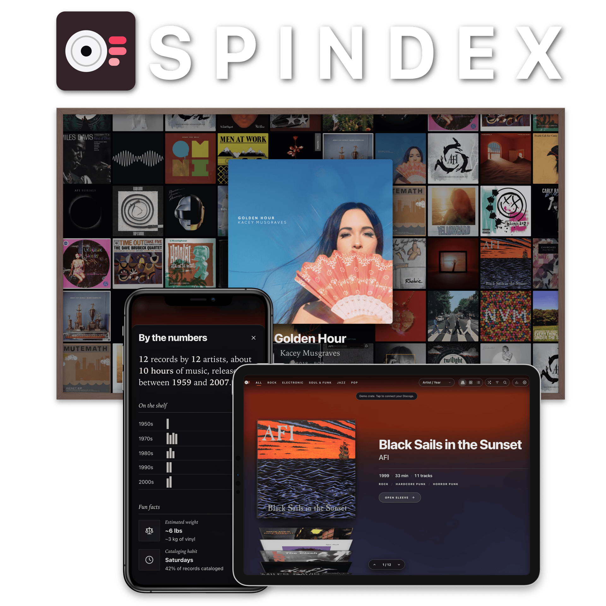

Spindex turns your album collection into a record crate in your browser. Flip through artwork, inspect jacket details, read lyrics, check your collection stats, scan barcodes, and leave a screensaver running beside your turntable.

  <a href="https://spindex.ryanmarch.me/?demo">Try Demo Crate</a> &bull;
  <a href="https://spindex.ryanmarch.me/docs/">User Guides</a>

## Digging the crate

Scroll through records and watch as the ambient lighting behind the crate adapts to the color palette of whichever album you hold.

### Three ways to browse

| Stack | Grid | List |
| :---: | :---: | :---: |
| 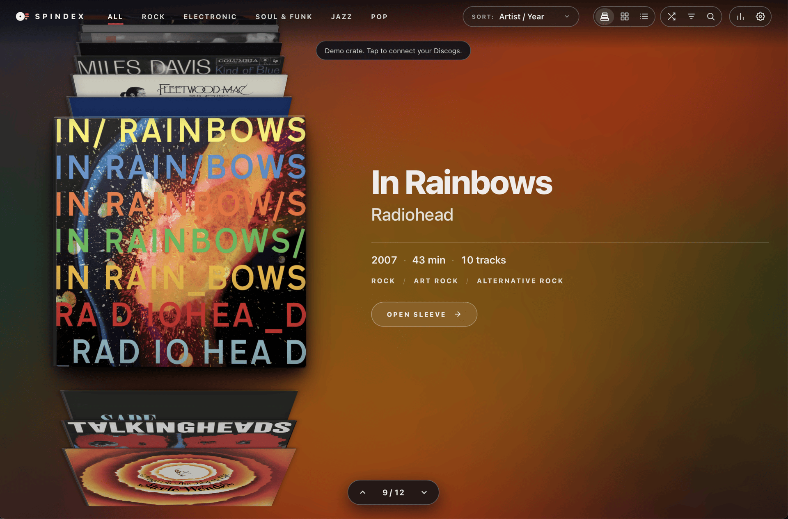 | 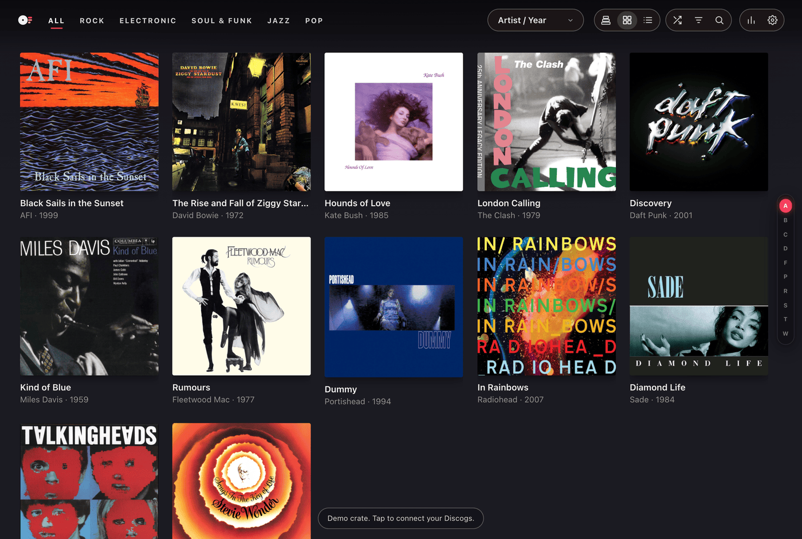 | 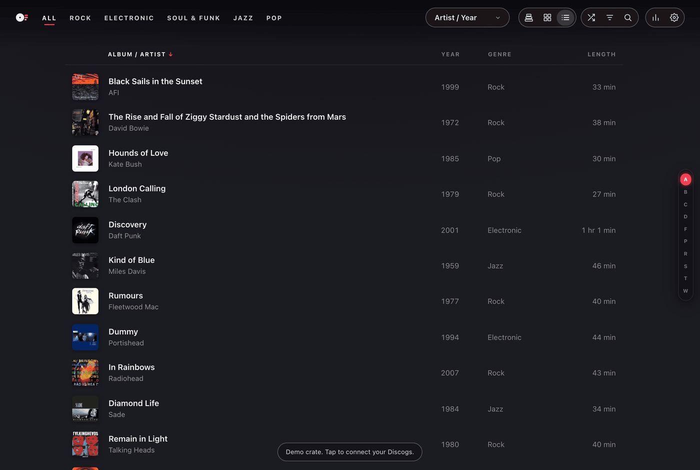 |
| Stack view to flip through each record | Visual cover gallery for fast scanning | Structured catalog view with formats and dates |

## Gatefold album inspector

Pull any record from the crate to open its gatefold sleeve.

  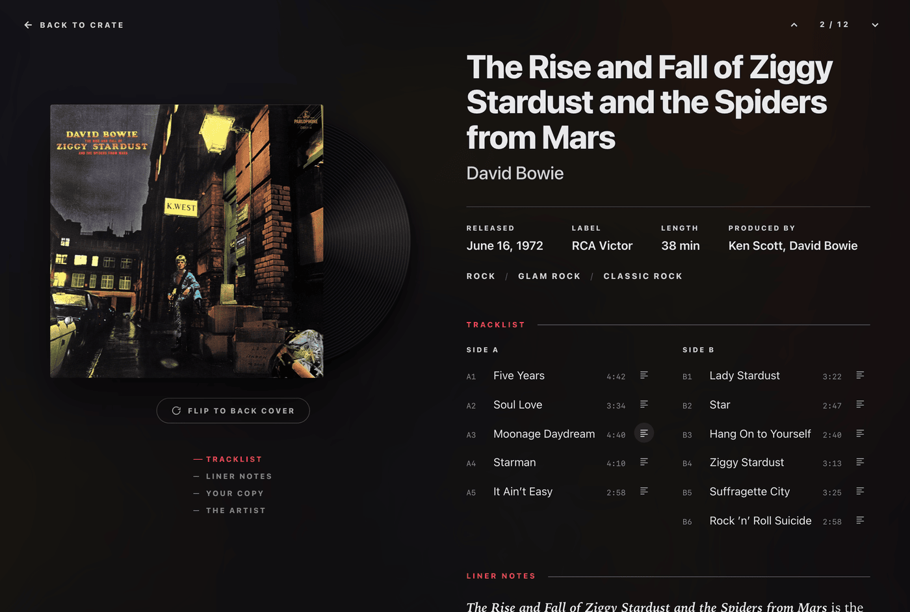

- **Vinyl color**: Preview the actual vinyl color and finish of your pressing, including classic black, splatter, marble, translucent, and picture discs.
- **Front and back covers**: View high-resolution sleeve art, then flip the jacket over to view the back cover.
- **Song lyrics**: Slide out the lyric sheet to follow song lyrics or look up tracks on Genius.
- **Credits and history**: Read artist biographies, recording background, and production credits.
- **Listen and watch**: Jump straight to releases on Apple Music or Deezer, or watch music videos directly on the page.

  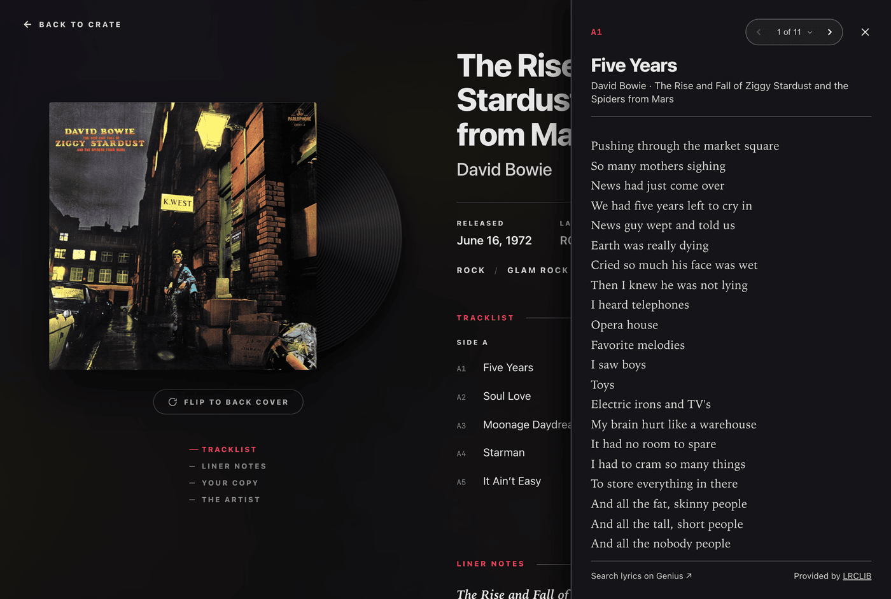

## Finding and filtering

Find the right record across collections of any size.

  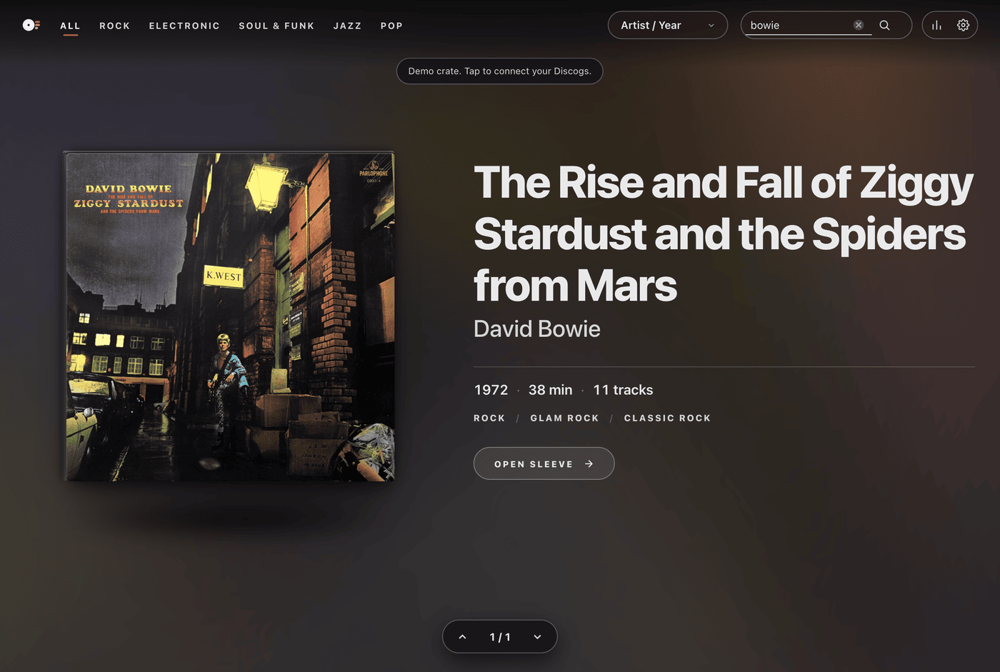

- **Instant search**: Press `/` anywhere to search titles, artists, and songs.
- **Genre tabs**: Filter by music genres.
- **Jump rail**: Slide down the alphabet or decade strip to jump straight to a section.
- **Crate filters**: Narrow your shelf by decade, disc size (12", 7", 10"), playback speed (33 RPM, 45 RPM), and pressing format.
- **Surprise me**: Shuffle your crate to pull a random selection when you need inspiration.

  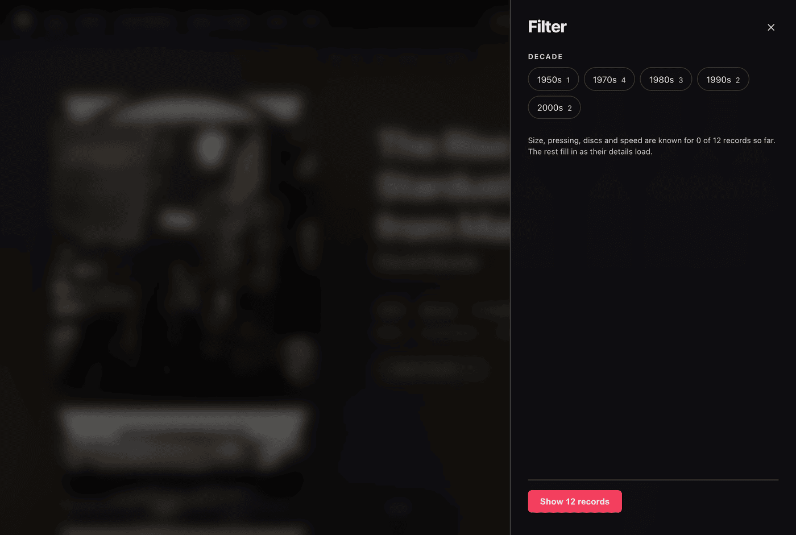

## Barcode scanner

Add new records to your collection straight from your phone or webcam.

  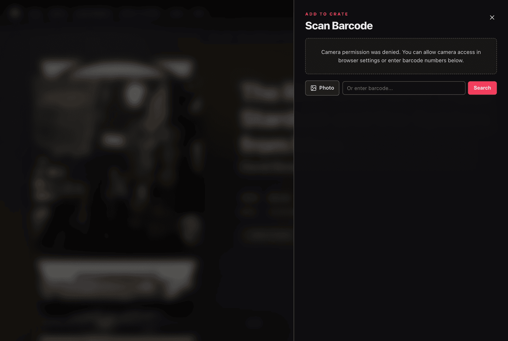

- Point your camera at any record jacket barcode to identify the exact release and variant.
- Includes flashlight toggle and camera switching on mobile phones.
- Upload jacket photos or enter barcodes manually when needed.

## Screensaver mode

Set a tablet on a stand next to your turntable, or mirror it to a TV.

  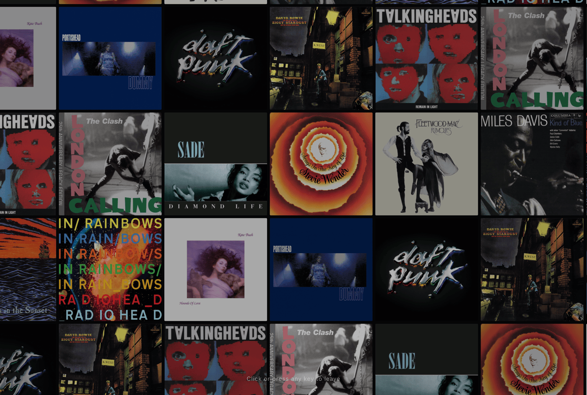

- Fills your display with a continuous wall of your album art.
- Highlights records from your collection every few seconds.
- Keeps your screen awake automatically.
- Press `4` anywhere in Spindex or open with `/?wall`.

## Collection insights

Explore facts and numbers about your vinyl shelves:

  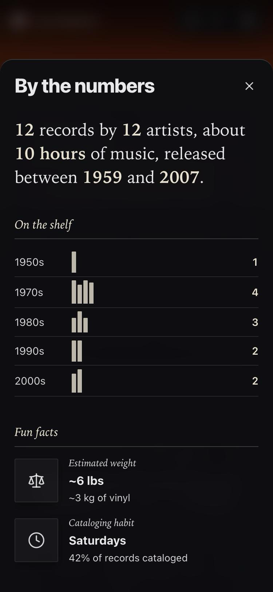

- **Shelf weight and value**: See estimated total collection weight and current marketplace value.
- **Listening time**: Calculate how many days of continuous playback your vinyl collection contains.
- **Visual breakdowns**: View charts of eras, decades, top genres, formats, and speeds.
- **Collection habits**: Discover your most frequent crate additions and collection milestones.
- **Fun facts**: Discover new facts and trivia about your collection every time you visit.

## Private crate sharing

Easily share your record collection with friends.

  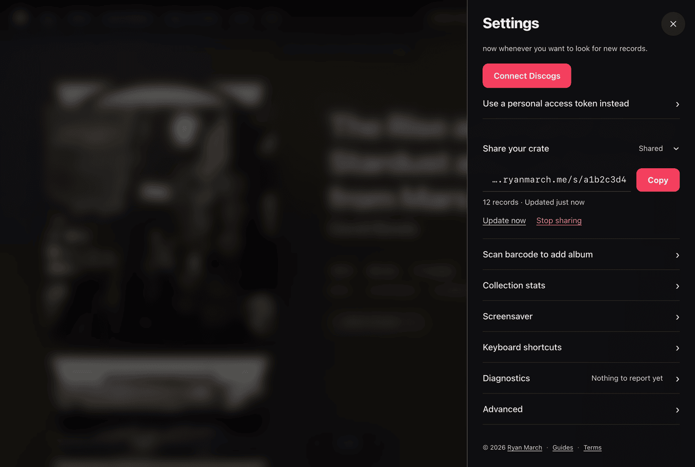

- **Read-only link**: Friends can flip through your crate in their own browser without creating an account.
- **Privacy protection**: Only public details like album art, tracklists, and pressings are shared. Personal notes, purchase prices, and condition grades stay on your device.
- **Revocable access**: Reset or turn off your share link at any time.

## Offline access

- **Works anywhere**: Once your crate loads, records and artwork store locally in your browser. Dig through your collection even on flights, commutes, or when you're offline.
- **Sync on demand**: Tap "Check now" to pull newly added Discogs records without background battery drain.
- **Try before connecting**: Explore the built-in 12-album demo crate before signing in with Discogs.

## Privacy
- **No ads, no trackers**: No advertising scripts, tracking pixels, or analytics watching what you browse. Nothing about your collection is sold.
- **Your records live on your device**: Your collection is stored locally in your browser and remains visible only to you.

## Keyboard shortcuts

| Shortcut | Action |
|---|---|
| <kbd>↑</kbd> <kbd>↓</kbd> or <kbd>←</kbd> <kbd>→</kbd> | Flip through crate |
| <kbd>Enter</kbd> | Open album sleeve |
| <kbd>A</kbd> to <kbd>Z</kbd> | Jump to letter |
| <kbd>/</kbd> | Search collection |
| <kbd>1</kbd> <kbd>2</kbd> <kbd>3</kbd> | Switch between Stack, Grid, and List |
| <kbd>4</kbd> | Start screensaver wall |
| <kbd>Esc</kbd> | Close drawer or sleeve |
| <kbd>?</kbd> | Show shortcuts help |

## User guides

Detailed guides with step-by-step instructions are available in the [help center](https://spindex.ryanmarch.me/docs/):

- [Getting started](https://spindex.ryanmarch.me/docs/getting-started/)
- [Digging the crate](https://spindex.ryanmarch.me/docs/digging-the-crate/)
- [Finding & filtering](https://spindex.ryanmarch.me/docs/finding-and-filtering/)
- [Gatefold album inspector](https://spindex.ryanmarch.me/docs/gatefold-album-inspector/)
- [Barcode scanner](https://spindex.ryanmarch.me/docs/barcode-scanner/)
- [Collection insights](https://spindex.ryanmarch.me/docs/collection-insights/)
- [Screensaver mode](https://spindex.ryanmarch.me/docs/screensaver-mode/)
- [Sharing your crate](https://spindex.ryanmarch.me/docs/sharing-your-crate/)

---

© 2026 Ryan March · <a href="https://ryanmarch.me">ryanmarch.me</a>

This application uses Discogs' API but is not affiliated with, sponsored, or endorsed by Discogs. "Discogs" is a trademark of Zink Media, LLC.
 

<a href="http://spindex.ryanmarch.me/terms#terms-of-service">Terms</a> · <a href="http://spindex.ryanmarch.me/terms#privacy-policy">Privacy</a> · <a href="http://spindex.ryanmarch.me/terms#third-party-services">Data sources</a>
